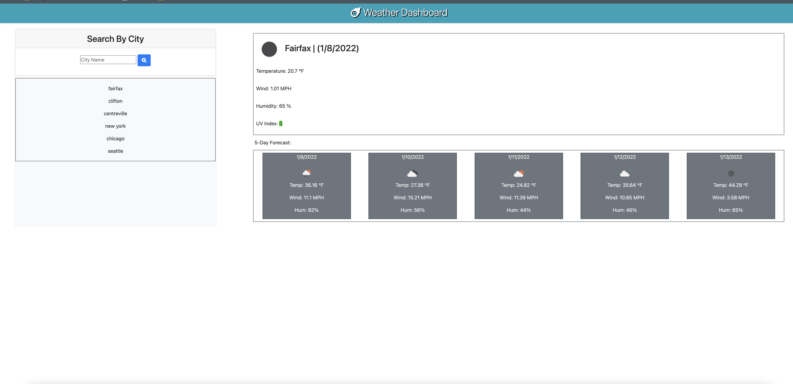

# dk_weather_dashboard_repo

<h1 align="center">Hello! I'm Daniel Kim</h1>
<h2 align="center">Challenge #6: Weather Dashboard</h2>

### 🔭 You may find the deployed application link is <mark>https://danielkim13.github.io/dk_weather_dashboard_repo/</mark>

### 👨‍💻This project repo can be found at <mark>https://github.com/danielkim13/dk_weather_dashboard_repo/</mark>

### 📫How to reach me **daniel.d.kim13@gmail.com**

#### Previous GW Boot Camp Assignments:

    - Challenge #1: Horiseon Front Page Refactor (HTML, CSS)
    - Challenge #2: Personal Portfolio (HTML, CSS)
    - Challenge #3: Password Generator (HTML, CSS, JS)
    - Challenge #4: JavaScript Quiz (HTML, CSS, JS, DOM)
    - Challenge #5: Work Day Scheduler (HTML, CSS, JS, DOM, Bootstrap, jQuery, jQueryUI, Moment)

<h2 align="center"><b>About the Project</b></h4>

Many travelers would like to see the weather outlook prior visiting their destinations. It would be nice to have a dashboard where they can search for the weather of cities to help them plan

<h4><u>User Story</u></h4>

    - AS A traveler
      I WANT to see the weather outlook for multiple cities
      SO THAT I can plan a trip accordingly

<h4><u>Acceptance Criteria</u></h4>

<b>GIVEN a weather dashboard with form inputs</b>

      - #1: WHEN I search for a city
            THEN I am presented with current and future conditions for that city and that city is added to the search history

      - #2: WHEN I view current weather conditions for that city
            THEN I am presented with the city name, the date, an icon representation of weather conditions, the temperature, the humidity, the wind speed, and the UV index

      - #3: WHEN I view the UV index
            THEN I am presented with a color that indicates whether the conditions are favorable, moderate, or severe

      - #4: WHEN I view future weather conditions for that city
            THEN I am presented with a 5-day forecast that displays the date, an icon representation of weather conditions, the temperature, the wind speed, and the humidity

      - #5: WHEN I click on a city in the search history
            THEN I am again presented with current and future conditions for that city

### ScreenShot of the project

